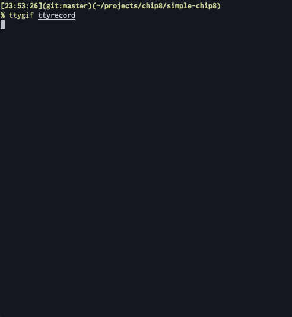

# 概要

Rust で実装されたターミナルで動作するシンプルな Chip8 エミュレータです

# 使い方

```
$ cargo run ./roms/BRIX
```

# キーボードレイアウト

|      |      |      |      |
|------|------|------|------|
| 1(1) | 2(2) | 3(3) | 4(C) |
| Q(4) | W(5) | E(6) | R(D) |
| A(7) | S(8) | D(9) | F(E) |
| Z(A) | X(0) | C(B) | V(F) |
